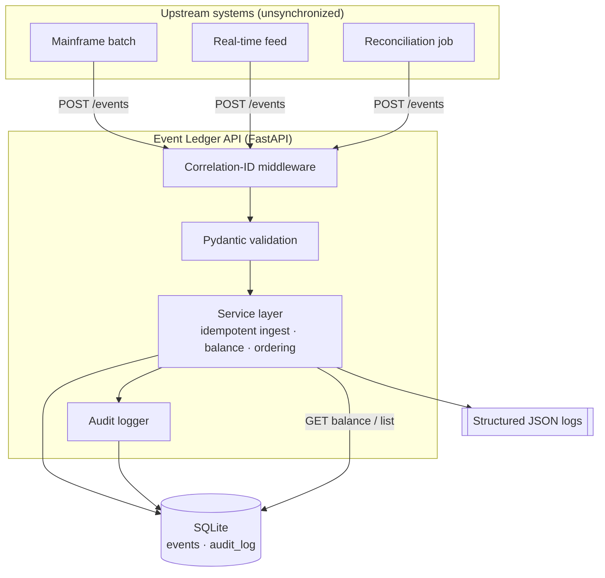
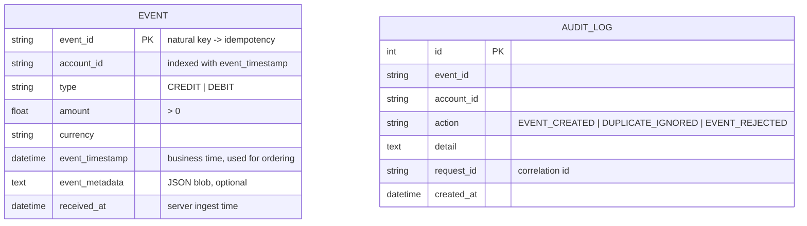
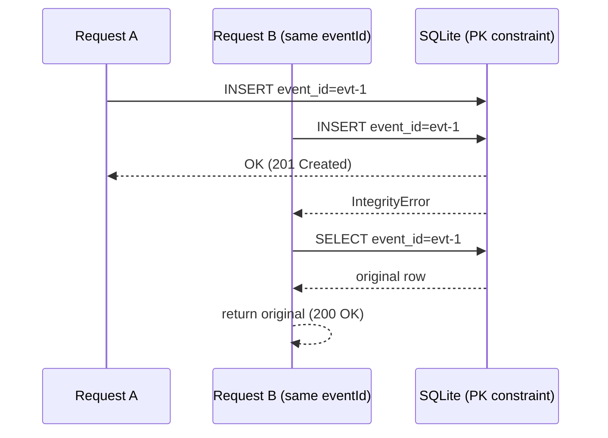
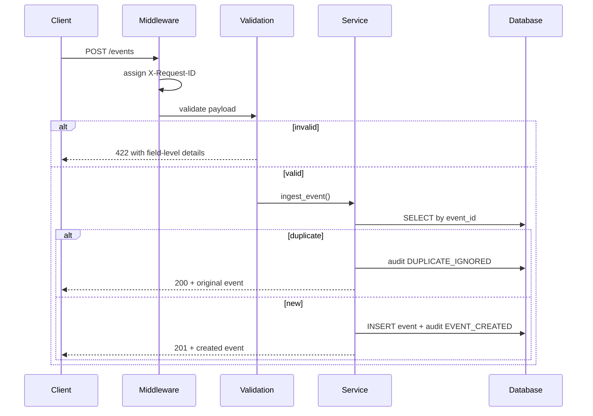

# Design Document — Event Ledger API

## 1. Problem statement

Ingest financial transaction events from multiple upstream systems that are **not
synchronized**, and serve correct per-account balances and chronological event
listings. Two failure modes must be handled as first-class concerns rather than
edge cases:

1. **Out-of-order delivery** — events do not arrive in `eventTimestamp` order.
2. **At-least-once delivery** — the same event (`eventId`) may arrive multiple times.

## 2. Guiding principle: an immutable, append-only ledger

The central decision is to model the system as an **event store**, not a mutable
account record:

- Events are written once and **never updated or deleted**.
- The account balance is **not stored** as a running total. It is **derived** from
  the event set on each read.
- Event ordering is **not** the order of arrival; it is computed by sorting on
  `eventTimestamp` at query time.

This single decision makes both hard requirements fall out naturally:

| Requirement | Why it is satisfied for free |
|---|---|
| Out-of-order tolerance | Order and balance are computed at read time, so arrival order is irrelevant by construction. There is no "wrong state" to correct. |
| Idempotency | `eventId` is the storage primary key. A duplicate is a primary-key collision the database rejects — there is no second row to create. |

This mirrors how real ledgers and event-sourced systems work: the log of facts is
authoritative, and projections (balance, ordered list) are computed from it.

## 3. Architecture

The codebase is layered so each concern is independently testable:

- **HTTP layer** (`main.py`) — routing, the correlation-id middleware, and
  translating exceptions into clean error responses.
- **Schema layer** (`schemas.py`) — Pydantic models enforce all validation rules
  at the edge before anything touches the database.
- **Service layer** (`service.py`) — all business logic: idempotent ingest,
  balance computation, chronological listing, and audit writes.
- **Persistence layer** (`database.py`) — the engine, session, and the two ORM
  models.

## 4. Data model

Two timestamps are kept deliberately: `event_timestamp` (when the transaction
*occurred* upstream — the basis for all ordering and the out-of-order story) and
`received_at` (when *we* stored it). Conflating them would lose the ability to
reason about late arrivals.

A composite index on `(account_id, event_timestamp)` backs both hot read paths —
listing and balance — so they stay efficient as the table grows.

### Audit trail

`audit_log` is append-only and records every state-changing attempt, including
rejected duplicates. For a financial system this gives a tamper-evident history of
"what did the service decide and when," independent of the event table itself.

## 5. Idempotency under concurrency

The naive approach — *check if it exists, then insert* — has a race: two
simultaneous POSTs for the same `eventId` can both pass the check and both insert.

Instead the service relies on the **database primary-key constraint as the single
arbiter**:

Exactly one writer wins; the loser catches the `IntegrityError`, reads the stored
row, and returns it with `200`. This is verified by a test that fires 12 concurrent
threads at the same `eventId` and asserts exactly one `201` and one stored row.

## 6. Request lifecycle

## 7. Status code semantics

| Situation | Status | Rationale |
|---|---|---|
| New event stored | `201 Created` | A new resource was created. |
| Duplicate `eventId` | `200 OK` | No new resource; the original is returned. |
| Validation failure | `422 Unprocessable Content` | Well-formed JSON, semantically invalid. |
| Unknown event id on GET | `404 Not Found` | Standard. |

## 8. Observability

- **Structured JSON logs** — one JSON object per line, ready for Splunk/ELK/CloudWatch.
- **Correlation ids** — every request gets an `X-Request-ID` (honored from the
  inbound header if present), attached to all logs and audit rows for that request,
  and echoed back in the response header for end-to-end tracing.

## 9. Trade-offs and what I would do next at scale

The derive-balance-on-read model is the right default: it is simple, always
correct, and impossible to corrupt. Its cost is that balance is `O(events for the
account)` per read.

For a high-volume production system the natural evolution, **without abandoning the
immutable log**, would be:

- **Balance snapshots / materialized projection** — maintain a periodically
  checkpointed balance per account and compute only the delta since the last
  snapshot, trading a little write/maintenance cost for fast reads.
- **Stronger money type** — represent amounts as integer minor units (cents) or
  `Decimal` end-to-end rather than float, to remove any floating-point rounding
  question from currency math.
- **Multi-currency** — the schema already stores per-event currency; a real system
  would either reject mixed-currency accounts or carry per-currency sub-balances.
- **Durable datastore** — swap SQLite for Postgres (the SQLAlchemy layer makes this
  a config change), gaining real concurrent writers and the same PK-based
  idempotency guarantee.

## 10. AI-assisted development notes

This solution was built with AI assistance across the SDLC, which the commit
history reflects as discrete, reviewable steps:

- **Design** — this document and its diagrams were drafted with an AI assistant,
  then reviewed and adjusted (e.g. the decision to keep balance derived rather than
  stored, and the optimistic-insert concurrency strategy).
- **Development** — the layered implementation, structured logging, and audit trail
  were generated and iterated on, then verified against a live server.
- **QA** — the test suite was authored to map one file per requirement area, run
  with coverage, and the deprecation warnings surfaced by the first run were fixed
  (modern FastAPI `lifespan`, current status-code constant).
